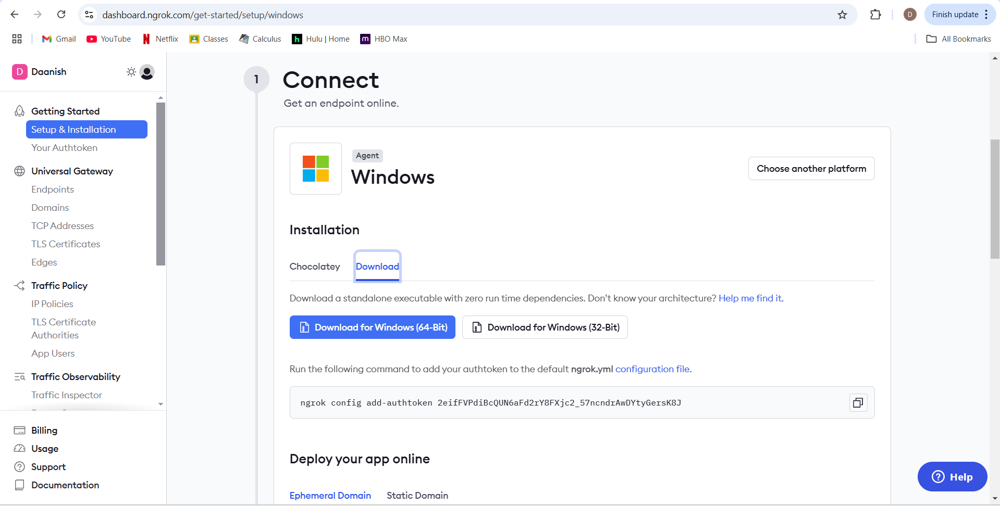
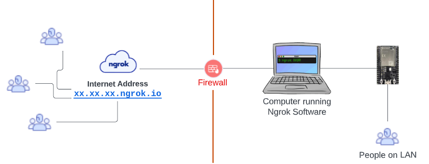
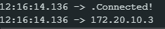
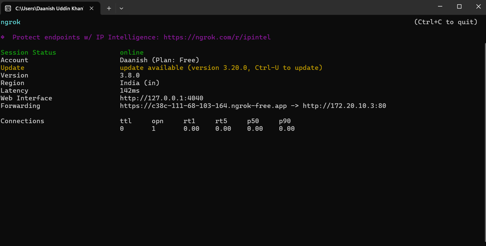
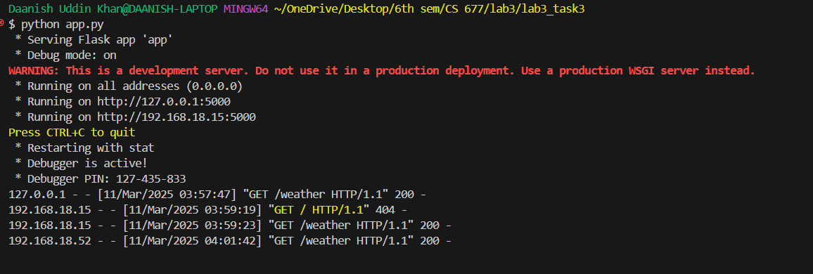

# LAB 3 - Networking and Communication
**Total tasks:** 3 (1 in-lab, 2 take-home)

**Deadline:** Sunday Apr 6, 2024 midnight

**Submission instructions:** Submit the `.ino` files, for all the tasks in the format `taskX.ino`, where `X` is the task number. Submission tab will be made available on LMS. For the first take home task (Task 2), rename your vidoe to `Task2`.

## In-lab tasks:
### Task 1 - Web-server with ESP32:
Your first and only lab task is to write a basic web-server, hosted on an ESP32, that is responsible for controlling the state of one LED and one RGB.

The ESP32 should host a web-page which provides two links and/or buttons which control the LED and RGB. The two links or buttons to control the LED/RGB should display the text based upon the state of the LEDRGB. So, if the LED is on, the button should say "Turn off LED", and vice versa.

The RGB should have three buttons for red, green and blue. So, if red is on, it should say "Turn red colour off" and the same for green and blue.

Lastly, using the mpu-6050, the web-page should also have a button to get the temperature reading from it. So, if the button is pressed the web-page should display the current temp.


## Take-home tasks:
### Task 2 - Putting ESP32 on the internet:
In this task, you will be connecting an ESP32, to a gateway so that it can be accessed over the internet. Primarily, we will be hosting a webpage on the ESP32, that can be accessed over the internet from anywhere, even with a dynamic IPv4 address.

We will be using `ngrok` for this purpose. `ngrok` is a service that allows you to expose your local server to the internet. The documentation can be found [here](https://ngrok.com/docs).

In order to complete this task, you will need to:
1. Sign up for a free account on `ngrok` at [https://dashboard.ngrok.com/signup](https://dashboard.ngrok.com/signup).
2. Download the `ngrok` client from [https://ngrok.com/download](https://ngrok.com/download).
3. The dashboard provides getting started instructions for each platform. Follow the instructions to get your `ngrok` client up and running. This involves downloading the client, adding the authtoken, and running the client. This would look something like follows:


You can download the ngrok terminal, run it and copy your auth token into the terminal.

Note that the auth token will be different for everyone.

Once `ngrok` has been set up and running, we can now expose a server running over the local network, to the internet. This is what the architecture would look like:



Your task, should you choose to accept it, is to create a simple web server on ESP32, that can be accessed over the internet. Since, for task1, you have a working server that can be accessed over the local network, you can use the same code, and expose it to the internet using `ngrok`. This can be done as follows:

```bash
$ ngrok http <ESP-32 IPv4 addr>
```

e.g. my ESP32 received an IP-address of 172.20.10.3 after connecting to my hotspot.



Remember to connect your laptop to the same hotspot your esp is connected to. Once done, you can run:
    
```bash
$ ngrok http 172.20.10.2
```

This will give you a public URL, that can be used to access the server running on your ESP32.



`ngrok` provides a URL that can be accessed from anywhere in the world. You can use this URL to access the server running on your ESP32. For me, the URL is  `https://c38c-111-68-103-164.ngrok-free.app`.

This task is complete when you can access the server running on your ESP32 from your phone, using the URL provided by `ngrok`. The submission will be a video of you turning the LED/RGB on and off using the webpage from your phone, showing the URL in the address bar.

### Task 3 - API calls with ESP32:
Let's move on to the next task, where you will be making API calls from the ESP32. This is a very useful feature, as it allows the ESP32 to interact with other devices, or services over the internet. This can be used to get data from the internet, or to send data to the internet.

The primary library to make API calls from the ESP32 is the `HTTPClient` library. This library allows you to make `GET`, `POST`, `PUT`, `DELETE` requests to a server, and get the response. Let's look at how to use this library. This is different from the earlier in-lab task, where you were hosting a server on the ESP32. In this task, the ESP32 will be the client, and will be making requests to a server hosted externally, either on your laptop, or on the cloud.

The `HTTPClient` library is a part of the arduino core, and is included by default. You can include the library in your code as follows:
```cpp
#include <HTTPClient.h>
```

The next step is to create an instance of the `HTTPClient` class, and use it to make requests. This is done as follows:
```cpp
HTTPClient http;
```

We can now make a request easily as follows:
```cpp
http.begin("http://<server-addr:port>");
// note that server address can also be a hostname.
int httpCode = http.GET();
```
where `http.begin()` is used to specify the URL of the server, and `http.GET()` is used to make a GET request to the server. The `httpCode` variable stores the response code from the server. The response code is a 3-digit number, e.g. 200 to indicate success, 404 to indicate not found, etc.

similarly, you can make a POST request as follows:
```cpp
http.begin("http://<server-addr:port>");
// note that server address can also be a hostname.
int httpCode = http.POST("data=10");
```
where `http.POST()` is used to make a POST request to the server, and the data is sent as a parameter to the function.

Make sure to close the connection after the request is made, as follows:
```cpp
http.end();
```

You may find the example file `API-test.ino` useful for this task. This file contains a basic HTTP client example, that makes a GET and POST request to a server periodically.

Since we have already learned how to create a basic http server in python using `flask`, we can create a simple backend server, that handles http requests on different routes. If everything is configured correctly, you may see the following output at your server.



Again, for the process to work, the two devices must be on the same local network (hotspot or wifi), or the devices must be accessible over the internet.

#### Task:
OpenWeatherMap is a service that provides weather data for any location in the world. You can get the weather data for a location, by making a GET request to the OpenWeatherMap API. The API documentation can be found [here](https://openweathermap.org/api).

You need to first create an account at OpenWeatherMap, and get an API key. This API key is used to authenticate your requests to the OpenWeatherMap API. Once you have the API key, you can make requests to the OpenWeatherMap API, to get the weather data for any location. For example, now that I have my API key, I can make http requests to the OpenWeatherMap API, to get the weather data for Lahore, as follows:
```bash
$ curl "http://api.openweathermap.org/data/2.5/weather?q=Lahore&appid=<your-api-key>"

{"coord":{"lon":74.3436,"lat":31.5497},"weather":[{"id":803,"main":"Clouds","description":"broken clouds","icon":"04d"}],"base":"stations","main":{"temp":299.14,"feels_like":299.14,"temp_min":298.21,"temp_max":299.14,"pressure":1011,"humidity":57},"visibility":6000,"wind":{"speed":4.12,"deg":330},"clouds":{"all":75},"dt":1711631293,"sys":{"type":1,"id":7585,"country":"PK","sunrise":1711587364,"sunset":1711631940},"timezone":18000,"id":1172451,"name":"Lahore","cod":200}%
```
Note that, your API key will get activated after about 10 minutes of you signing-up, so don't worry if you get the invalid API-key error.

Your task is to write an ESP32 application that simply makes these API calls and then prints the current weather situation on the serial monitor. Please make sure that you are not making the requests very frequently as there is a limit on the number of requests (60 calls per minute). So, remember to use `delay` with a large parameter.

Note that the response is in JSON format. You can use the `ArduinoJson` library to parse the JSON response, and extract the required information.